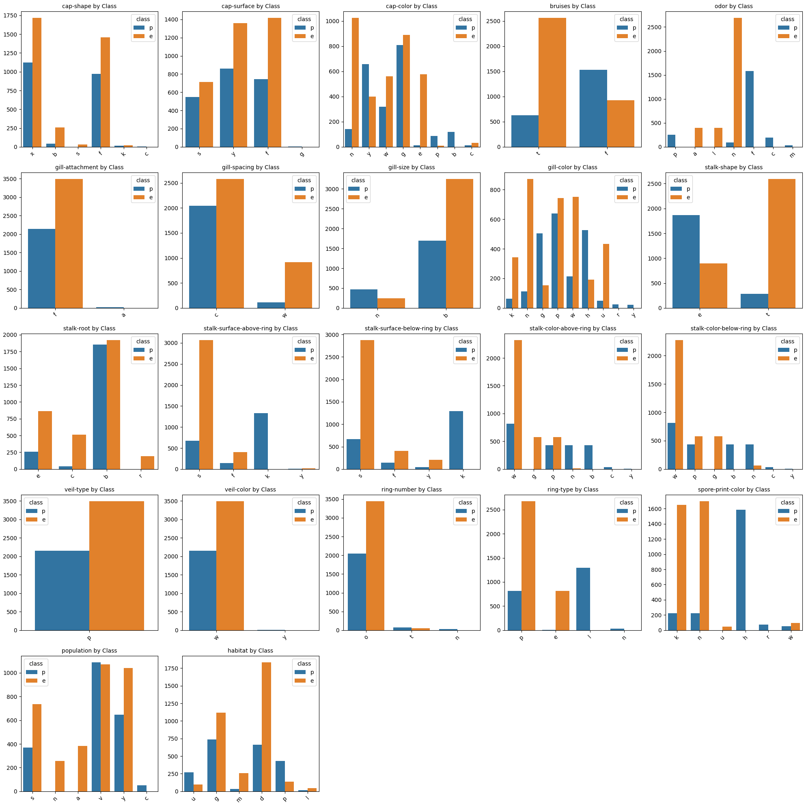
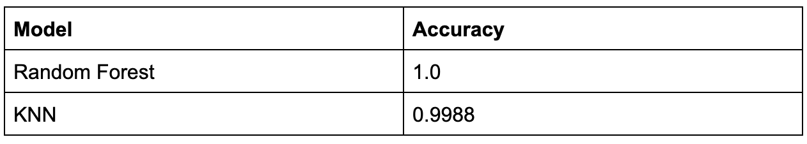

# Mushroom Classification

* This repository holds an attempt to classify mushrooms as edible or poisonous using various machine learning models on data from the Kaggle Mushroom Classification Dataset (https://www.kaggle.com/datasets/uciml/mushroom-classification/data). 

## Overview

* Definition of the task/challenge:
The goal is to classify mushrooms as edible or poisonous based solely on physical characteristics. The dataset contains only categorical features, making this a good test of models that can handle non-numeric input effectively.

Approach:
This project frames the problem as a binary classification task. The data was cleaned and label encoded, and three models were explored:
* Random Forest
* K-Nearest Neighbors

Performance summary:
The best-performing model was Random Forest, which achieved a perfect score. The classification report and confusion matrix confirm strong performance across both classes.

## Summary of Work Done

### Data

Data:
* Type: CSV file with 22 categorical features and one target label (edible or poisonous).
* Size: 8124 instances total.

Split:
* Training set: 80%
* Testing set: 20%

#### Preprocessing / Clean up
* Missing values were removed.
* All categorical variables were label encoded.
* The dataset was scaled as needed depending on the model.

#### Data Visualization

* Count plots for class distribution and features.
* Correlation heatmap using label-encoded values.
* Feature importance visualization from Random Forest.

From the visualizations, we observe:
* Odor is a highly distinguishing feature — certain odors (like n and f) are almost exclusively associated with either edible or poisonous mushrooms.
* Gill color and spore print color also show strong class separation, with some values appearing almost exclusively in one class.
* Features like veil-type and ring-number show little to no variation and may not contribute significantly to classification performance.
* Bruises and gill-spacing offer moderate separation, possibly aiding model learning.
* Other features like cap-shape or habitat are more evenly distributed across classes and might be less predictive individually but still useful when combined with others.

### Problem Formulation

* Input: 22 physical characteristics of mushrooms (all categorical).
* Output: Binary class (edible or poisonous).

Models
* Random Forest Classifier (performed best).
* K-Nearest Neighbors (used for comparison).

Hyperparameters:
* Random Forest: default parameters
* KNN: tested for different k values

### Training

Environment:
* Python (Jupyter Notebook & Google Collab)
* Libraries: pandas, numpy, matplotlib, seaborn, scikit-learn

Training time:
* Very short (dataset is small, most models train in seconds on CPU).

Stopping criteria:
* No early stopping is required due to the short training time.

Challenges:
* Categorical-only data required label encoding; some models were more sensitive to feature scaling.

### Performance Comparison

Metric: Accuracy and classification report (precision, recall, F1-score).

Visualizations:
* Confusion matrices for each model.

### Conclusions

* Random Forest performed best with the highest accuracy and strong generalization.
* The dataset was clean and well-balanced, which helped model performance.

### Future Work

* Test more advanced models (e.g., XGBoost, LightGBM).
* Try feature selection to reduce dimensionality.
* Investigate model interpretability tools (e.g., SHAP values).

## How to reproduce results

To fully reproduce the results of this project, follow the steps to reproduce this project's results. You can run the notebook locally or in a cloud-based environment like Google Colab.

Run in Google Colab (Recommended)
1. Open Google Colab.
2. Upload the file DATA3402_Final.ipynb.
3. Download the dataset mushrooms.csv from this Kaggle page.
4. Upload mushrooms.csv to the same Colab session.
5. Run all cells to:
   * Load and preprocess the data
   * Train and evaluate the models
   * View visualizations and metrics
No GPU or TPU is required due to the small size of the dataset and models.

### Overview of files in repository

* MushroomClassification.ipynb: The first look at the code, with very basic tests and cleaning, a rough draft.
* DATA3402_Final: The final code includes full analysis, preprocessing, modeling, and evaluation.
* submission.csv: The file that was created from the final code, showing the ID of the mushroom and the prediction of whether it is edible or poisonous. 

### Software Setup

Requirements:
* pandas
* numpy
* matplotlib
* seaborn
* scikit-learn

## Citations

* Dataset from Kaggle: https://www.kaggle.com/datasets/uciml/mushroom-classification/data

